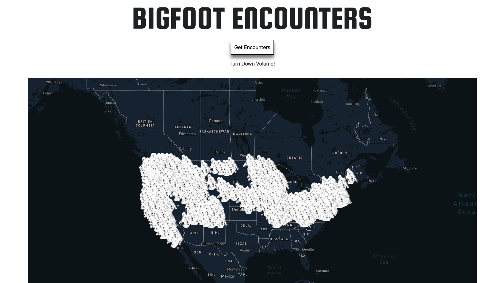
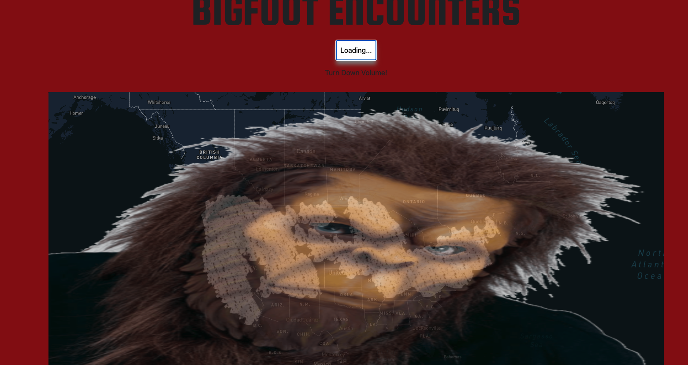
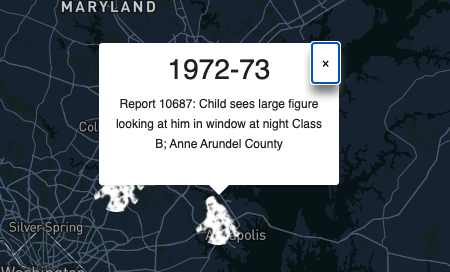

# Bigfoot Encounters

## Description

A sort of silly simple app that I made to show the user their location on a map and show all descriptions of bigfoot sightings on that map. It was more frustrating than amusing to make but the "finished" app is ok. I would like to make it so that bigfoot sightings would only be displayed after and in the viciinity of the user. It wold also be nice if the user could search places on the map.

You can visit the app [HERE](https://petermodavis.github.io/bigfoot/)

## Technology

[React](https://reactjs.org/) 
[Mapbox](https://www.mapbox.com/) 
[Bigfoot Locations](https://hub.arcgis.com/datasets/9947fc49e6c44120b4a1b3133c073dbc_0/explore) 

## Usage

Just go to the link provided.

Click on the big button (beware of the roar!).

Then click on a bigfoot to see a description.

## Contact

pmodavis.webdev@gmail.com

## License

Copyright 2021 Peter MoDavis

Permission is hereby granted, free of charge, to any person obtaining a copy of this software and associated documentation files (the "Software"), to deal in the Software without restriction, including without limitation the rights to use, copy, modify, merge, publish, distribute, sublicense, and/or sell copies of the Software, and to permit persons to whom the Software is furnished to do so, subject to the following conditions:

The above copyright notice and this permission notice shall be included in all copies or substantial portions of the Software.

THE SOFTWARE IS PROVIDED "AS IS", WITHOUT WARRANTY OF ANY KIND, EXPRESS OR IMPLIED, INCLUDING BUT NOT LIMITED TO THE WARRANTIES OF MERCHANTABILITY, FITNESS FOR A PARTICULAR PURPOSE AND NONINFRINGEMENT. IN NO EVENT SHALL THE AUTHORS OR COPYRIGHT HOLDERS BE LIABLE FOR ANY CLAIM, DAMAGES OR OTHER LIABILITY, WHETHER IN AN ACTION OF CONTRACT, TORT OR OTHERWISE, ARISING FROM, OUT OF OR IN CONNECTION WITH THE SOFTWARE OR THE USE OR OTHER DEALINGS IN THE SOFTWARE.

## Badges

